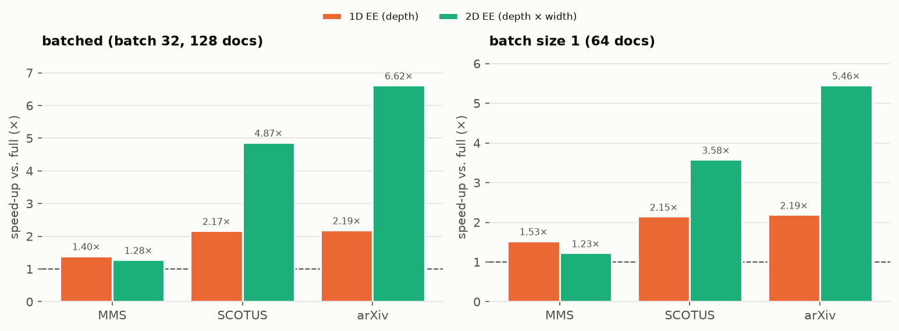
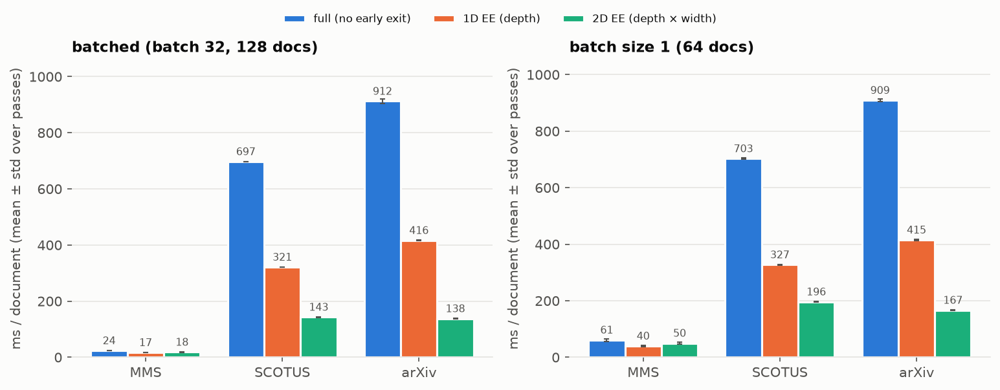
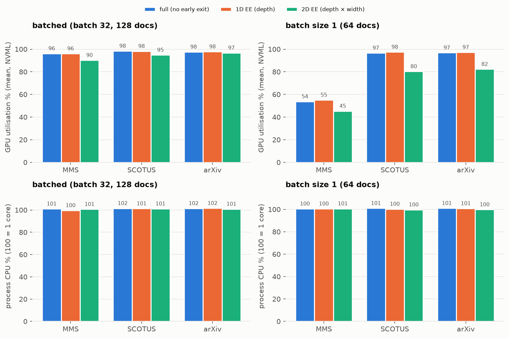
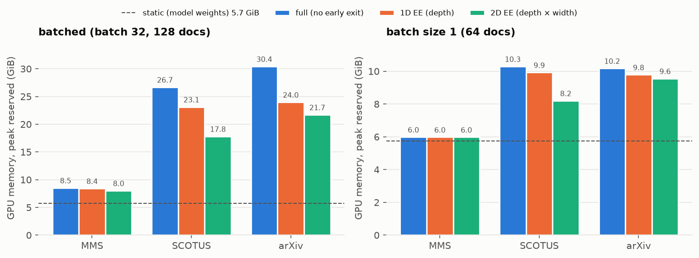
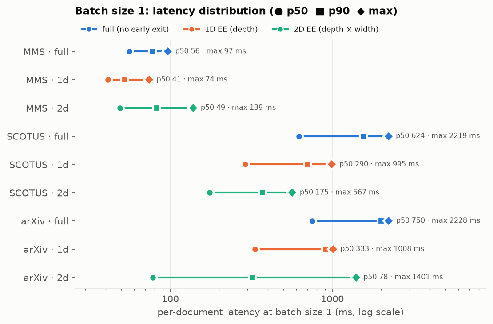
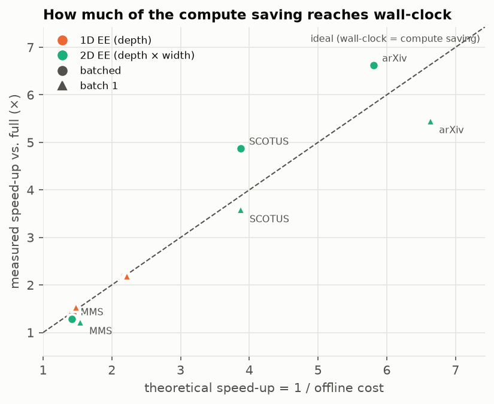
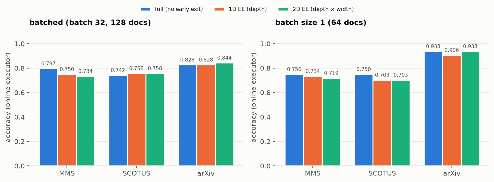

# Runtime performance: CPU/GPU utilisation and real-world operation

This page reports how the 2D early-exit method behaves when it is actually executed on hardware: wall-clock latency with repeated timing, GPU and CPU utilisation, GPU memory, and single-request (batch size 1) latency. Hardware utilisation cannot be derived from batch size or from ms/document, so it is measured directly.

We compare three execution modes of the same backbone:

- **full** – no early exit: every layer over the whole input (reference);
- **1D EE** – early exit in depth only: the full input is processed and the model exits at an intermediate layer;
- **2D EE** – our method: input chunks enter progressively while deeper layers are activated (depth × width), and the model exits at a (layer, chunk) cell.

Both early-exit modes use the thresholds calibrated on the validation split; the stop decision is taken online, inside the execution loop.

## Key results

- **Speed-up of 2D EE over full, batched:** MMS **1.28×** (1D 1.40×); SCOTUS **4.87×** (1D 2.17×); arXiv **6.62×** (1D 2.19×).
- **Speed-up of 2D EE over full, batch 1:** MMS **1.23×** (1D 1.53×); SCOTUS **3.58×** (1D 2.15×); arXiv **5.46×** (1D 2.19×).
- **Utilisation, batched:** GPU 90–98 %, host CPU 100–102 % of one core.
- **Utilisation, batch 1:** GPU 45–98 %, host CPU 100–101 % of one core.
- **Peak GPU memory, batched (full → 2D):** MMS 8.5 → 8.0 GiB; SCOTUS 26.7 → 17.8 GiB; arXiv 30.4 → 21.7 GiB.
- **Peak GPU memory, batch 1 (full → 2D):** MMS 6.0 → 6.0 GiB; SCOTUS 10.3 → 8.2 GiB; arXiv 10.2 → 9.6 GiB.
- **Repeatability:** 3 timed passes per configuration; relative std of ms/document 0.02–7.3 %.
- **Correctness:** online exit decisions reproduce the offline evaluation for every early-exit configuration (`match = YES`). No errors in the logs.

## Observations

- At batch size 1 on short inputs (MMS: GPU 54 %) the GPU is partly idle: each request is only a few kernels long, so the single-threaded host launching them becomes the bottleneck. This affects all modes, including full.
- On short documents (MMS) 2D EE is slower than 1D EE: there are few chunks, so exiting in width saves little while the progressive schedule adds overhead. The benefit of 2D grows with document length.
- In batched mode the measured 2D speed-up exceeds the theoretical one (SCOTUS, arXiv): the theoretical figure counts grid cells, but the skipped late chunks are the most expensive ones because their attention spans the longest context.
- CPU usage is about one core in every configuration: the executor is a single host thread that schedules GPU kernels; the method adds no CPU-side computation that would scale with the input.

## Setup

| | |
|---|---|
| Backbone | Qwen2.5-3B-Instruct, fp16, 36 decoder layers; exit decisions every 4 layers |
| Datasets | MMS, SCOTUS, arXiv – test split, random sample (seed 0); exit granularity: chunks of 128 tokens (MMS) / 512 tokens (SCOTUS, arXiv); the executor processes 512-token columns |
| Batched phase | batch 32, 128 documents per dataset |
| Batch size 1 phase | 64 documents per dataset, one request at a time |
| Timing | 1 warm-up batch, then 3 timed passes |
| GPU | 1× NVIDIA A100-SXM4-40GB (40 GB), driver 575.57.08; exclusive use, checked idle before start |
| CPU | AMD EPYC 7742 64-Core Processor |
| Software | Python 3.12.3, PyTorch 2.6.0+cu124 (CUDA 12.4), FlashInfer 0.2.5, Transformers 4.51.1 |
| Measured | 2026-09-29 |

## Speed-up

*Speed-up = ms/document of full ÷ ms/document of the mode (higher is better; dashed line = 1×).*

## Latency

*Wall-clock time per document. Error bars: standard deviation over the timed passes.*

## CPU and GPU utilisation

*Hardware utilisation during the timed passes: GPU utilisation (NVML, sampled every 100 ms) and CPU usage of the process (psutil).*

## GPU memory

*Peak GPU memory reserved by the PyTorch allocator; dashed line = static memory of the model weights.*

## Batch size 1 latency

*Batch size 1: per-document latency (p50, p90, maximum) – the relevant view for interactive serving. p99 is not reported because with a sample of this size it coincides with the maximum.*

## Theoretical vs. measured speed-up

*Theoretical speed-up (1 / offline cost, i.e. the share of grid cells computed) versus the measured one. Only 2D points are labelled (1D points cluster together). Below the diagonal: executor overhead; above: the saving is larger than the cell count suggests.*

## Accuracy (sanity check)

*Accuracy of the online executor on the measured sample. This is a correctness check against the offline evaluation (`match`), not the paper's accuracy, which is reported on the full test sets.*

## Full results

| phase | dataset | mode | docs | ms/doc mean ± std | min | speed-up | offline cost | accuracy online | accuracy offline | match |
|---|---|---|--:|--:|--:|--:|--:|--:|--:|:-:|
| batched | MMS | full | 128 | 23.6 ± 0.1 | 23.5 | – | 1.000 | 0.7969 | – | n/a |
| batched | MMS | 1d | 128 | 16.9 ± 0.1 | 16.7 | 1.40× | 0.699 | 0.7500 | 0.7500 | YES |
| batched | MMS | 2d | 128 | 18.4 ± 0.3 | 18.2 | 1.28× | 0.705 | 0.7344 | 0.7344 | YES |
| batched | SCOTUS | full | 128 | 697.2 ± 0.6 | 696.8 | – | 1.000 | 0.7422 | – | n/a |
| batched | SCOTUS | 1d | 128 | 321.3 ± 0.1 | 321.2 | 2.17× | 0.457 | 0.7578 | 0.7578 | YES |
| batched | SCOTUS | 2d | 128 | 143.1 ± 1.3 | 142.2 | 4.87× | 0.258 | 0.7578 | 0.7578 | YES |
| batched | arXiv | full | 128 | 912.4 ± 8.4 | 906.7 | – | 1.000 | 0.8281 | – | n/a |
| batched | arXiv | 1d | 128 | 416.4 ± 1.3 | 415.1 | 2.19× | 0.457 | 0.8281 | 0.8281 | YES |
| batched | arXiv | 2d | 128 | 137.8 ± 0.4 | 137.5 | 6.62× | 0.172 | 0.8438 | 0.8438 | YES |
| batch 1 | MMS | full | 64 | 61.2 ± 4.5 | 57.0 | – | 1.000 | 0.7500 | – | n/a |
| batch 1 | MMS | 1d | 64 | 40.0 ± 1.4 | 39.2 | 1.53× | 0.676 | 0.7344 | 0.7344 | YES |
| batch 1 | MMS | 2d | 64 | 49.9 ± 2.8 | 47.4 | 1.23× | 0.647 | 0.7188 | 0.7188 | YES |
| batch 1 | SCOTUS | full | 64 | 702.7 ± 2.3 | 700.3 | – | 1.000 | 0.7500 | – | n/a |
| batch 1 | SCOTUS | 1d | 64 | 327.4 ± 1.4 | 326.4 | 2.15× | 0.459 | 0.7031 | 0.7031 | YES |
| batch 1 | SCOTUS | 2d | 64 | 196.2 ± 0.6 | 195.5 | 3.58× | 0.258 | 0.7031 | 0.7031 | YES |
| batch 1 | arXiv | full | 64 | 909.1 ± 5.1 | 905.6 | – | 1.000 | 0.9375 | – | n/a |
| batch 1 | arXiv | 1d | 64 | 415.1 ± 1.5 | 413.5 | 2.19× | 0.450 | 0.9062 | 0.9062 | YES |
| batch 1 | arXiv | 2d | 64 | 166.6 ± 1.8 | 165.5 | 5.46× | 0.151 | 0.9375 | 0.9375 | YES |

### Resources

| phase | dataset | mode | GPU util % (mean) | GPU mem static / peak alloc / peak reserved (MiB) | GPU mem of process, max (MiB) | CPU % mean / max (100 = 1 core) | RSS max (MiB) |
|---|---|---|--:|--:|--:|--:|--:|
| batched | MMS | full | 96.2 | 5878 / 8406 / 8744 | 9250 | 101.0 / 118.8 | 1370 |
| batched | MMS | 1d | 96.1 | 5878 / 8246 / 8624 | 9130 | 99.6 / 117.5 | 1370 |
| batched | MMS | 2d | 90.2 | 5878 / 7988 / 8224 | 8732 | 100.7 / 109.2 | 1372 |
| batched | SCOTUS | full | 98.4 | 5878 / 26818 / 27344 | 27850 | 101.5 / 129.3 | 1433 |
| batched | SCOTUS | 1d | 98.2 | 5878 / 23182 / 23684 | 24192 | 101.3 / 118.8 | 1459 |
| batched | SCOTUS | 2d | 94.8 | 5878 / 17728 / 18244 | 18752 | 101.1 / 118.5 | 1441 |
| batched | arXiv | full | 97.6 | 5878 / 30678 / 31164 | 31670 | 101.5 / 118.8 | 1459 |
| batched | arXiv | 1d | 97.8 | 5878 / 24066 / 24564 | 25070 | 101.6 / 119.3 | 1514 |
| batched | arXiv | 2d | 96.8 | 5878 / 21862 / 22244 | 22752 | 100.9 / 118.9 | 1503 |
| batch 1 | MMS | full | 53.7 | 5878 / 6075 / 6130 | 6636 | 100.5 / 118.0 | 1392 |
| batch 1 | MMS | 1d | 55.1 | 5878 / 6063 / 6124 | 6630 | 100.5 / 108.5 | 1393 |
| batch 1 | MMS | 2d | 45.3 | 5878 / 6063 / 6124 | 6570 | 100.6 / 109.1 | 1396 |
| batch 1 | SCOTUS | full | 96.7 | 5878 / 9918 / 10544 | 11052 | 101.0 / 119.1 | 1451 |
| batch 1 | SCOTUS | 1d | 97.5 | 5878 / 9662 / 10164 | 10672 | 100.3 / 119.1 | 1458 |
| batch 1 | SCOTUS | 2d | 80.3 | 5878 / 8143 / 8404 | 8532 | 99.7 / 109.3 | 1455 |
| batch 1 | arXiv | full | 96.9 | 5878 / 9918 / 10424 | 10932 | 101.0 / 119.0 | 1502 |
| batch 1 | arXiv | 1d | 97.3 | 5878 / 9534 / 10024 | 10532 | 100.8 / 118.4 | 1509 |
| batch 1 | arXiv | 2d | 82.3 | 5878 / 9406 / 9784 | 10292 | 99.8 / 109.3 | 1513 |

### Batch size 1 latency

| dataset | mode | requests | p50 (ms) | p90 (ms) | max (ms) |
|---|---|--:|--:|--:|--:|
| MMS | full | 192 | 55.9 | 77.6 | 96.7 |
| MMS | 1d | 192 | 41.3 | 52.4 | 74.2 |
| MMS | 2d | 192 | 48.9 | 82.8 | 138.9 |
| SCOTUS | full | 192 | 624.0 | 1549.3 | 2218.8 |
| SCOTUS | 1d | 192 | 289.8 | 703.1 | 994.6 |
| SCOTUS | 2d | 192 | 174.9 | 370.2 | 567.0 |
| arXiv | full | 192 | 749.7 | 2003.6 | 2228.4 |
| arXiv | 1d | 192 | 332.9 | 905.6 | 1008.3 |
| arXiv | 2d | 192 | 77.9 | 320.9 | 1400.5 |

Requests = documents × timed passes.

### Early-exit configurations

Thresholds selected on the validation split (format `schedule/window/min layer/rule/threshold/...`).

| dataset | mode | configuration |
|---|---|---|
| MMS | 1d | `depth_ramp/lwin3/27/maxprob/0.97/8/True` |
| MMS | 2d | `gamma2.0/lwin3/27/maxprob/0.97/0/False` |
| SCOTUS | 1d | `depth_ramp/lwin3/27/margin/0.3/12/True` |
| SCOTUS | 2d | `gamma3.0/lwin3/15/margin/0.3/12/False` |
| arXiv | 1d | `depth_ramp/lwin7/23/margin/0.3/12/True` |
| arXiv | 2d | `gamma2.0/lwin7/19/maxprob/0.8/8/False` |

## Methodology

- **Executor.** A batched online executor runs the real backbone weights with a paged KV cache (FlashInfer). Every (layer, chunk) cell is computed exactly once: when new chunks enter at depth *l*, they catch up through layers 1…*l*−1 attending to the cached earlier chunks, without recomputation. A document leaves the batch as soon as its stop rule fires. The cost of the classification head (MLP hidden → 256 → classes) is executed at every decision point.
- **What is simplified, and why timing stays exact.** Token values are random, since matmul/attention time does not depend on the values. Real per-document lengths are used. The stop decision reads the trained heads' stored outputs, which are identical to what live heads produce on the same states; the `match` column verifies that the online decisions reproduce the offline evaluation.
- **Timing.** One warm-up batch (JIT compilation), then repeated timed passes over the same sample; we report mean ± std and the minimum. At batch size 1 every request is synchronised individually to obtain per-request latency.
- **Clean GPU.** Before each run the script verifies the GPU is idle (utilisation ≤ 5 %, memory ≤ 1000 MiB, no other process); timing on a shared GPU would be meaningless.
- **Utilisation.** NVML is sampled every 100 ms during the timed passes (GPU utilisation, device and process memory); psutil samples the process CPU usage and RSS. Peak memory also comes from `torch.cuda.max_memory_{allocated,reserved}`.
- **Reading GPU utilisation.** NVML utilisation is the fraction of time at least one kernel is running – not SM occupancy or a fraction of peak FLOPs. 100 % means the GPU never waits for the host; it does not mean the compute units are saturated.
